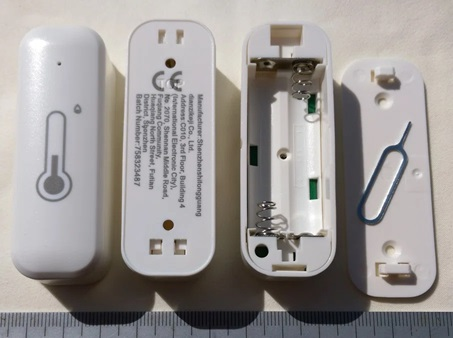

# Tuya TH06
get log Temperature/Humidity/Battery.

## Environment
AlmaLinux release 8.8 (Sapphire Caracal)

openjdk 11.0.22 2024-01-16 LTS

OpenJDK Runtime Environment (Red_Hat-11.0.22.0.7-1) (build 11.0.22+7-LTS)

OpenJDK 64-Bit Server VM (Red_Hat-11.0.22.0.7-1) (build 11.0.22+7-LTS, mixed mode, sharing)

Apache Maven 3.9.6

Tuya TH06 (WiFi Temperature/Humidity sensor)

<a target="img" href="./README.jpg"></a>

## Advance Preparation

### Android

install "SmartLife 7.8.4", start.

regist email.

search TH06, add.

### Tuya IoT Platform https://auth.tuya.com/

regist email.

add project.

select Data Center == "End Point URL".

activate "IoT Core".

get "Access ID" (==Client ID).

get "Access Secret".

regist TH06 (scan QR by Android "SmartLife 7.8.4").

get "Device ID".

article https://note.com/remix_asia/n/n3fd2d5fa74d9

## Make, Run
```
git clone https://github.com/remixgrjp/TH06.git
cd TH06
mvn clean compile
mvn exec:java -Dexec.mainClass=jp.example.App
```

## Usage
```
0: URL: https://openapi.tuyaus.com <==
1: CLIENT_ID: ******************** <==
2: ACCESS_SECRET: ******************************** <==
3: DEVICE_ID: ********************** <==
4: Get last status
5: past->start_time-> [end_time] ->now: 2026-07-05 00:00:00 (1783177200000)
6: Get log Temperature
7: Get log Humidity
8: Get log Battery
Q: quit
> _
```

2026-07-05 NOW
```
1783175725279,2026-07-04 23:35:00,24.5
1783173829936,2026-07-04 23:03:00,24.9
1783171996750,2026-07-04 22:33:00,25.0
1783170162012,2026-07-04 22:02:00,25.1
1783168328454,2026-07-04 21:32:00,25.1
1783166493069,2026-07-04 21:01:00,25.1
1783164658434,2026-07-04 20:30:00,25.3
1783162824352,2026-07-04 20:00:00,25.4
1783159156751,2026-07-04 18:59:00,25.7
1783157322960,2026-07-04 18:28:00,26.0
1783155490209,2026-07-04 17:58:00,26.3
1783153656342,2026-07-04 17:27:00,26.5
1783151823040,2026-07-04 16:57:00,26.6
1783149991699,2026-07-04 16:26:00,26.7
1783148154441,2026-07-04 15:55:00,26.8
1783146321063,2026-07-04 15:25:00,27.0
1783144486186,2026-07-04 14:54:00,27.2
1783142652288,2026-07-04 14:24:00,27.3
1783140819755,2026-07-04 13:53:00,27.5
1783138983360,2026-07-04 13:23:00,27.4
1783137148940,2026-07-04 12:52:00,27.2
1783135314022,2026-07-04 12:21:00,26.7
1783131651795,2026-07-04 11:20:00,25.2
1783129817890,2026-07-04 10:50:00,25.6
1783127984905,2026-07-04 10:19:00,25.6
1783126150495,2026-07-04 09:49:00,25.1
1783124318216,2026-07-04 09:18:00,23.9
1783122487754,2026-07-04 08:48:00,23.6
1783120655833,2026-07-04 08:17:00,23.0
1783118825362,2026-07-04 07:47:00,22.6
1783116995297,2026-07-04 07:16:00,22.3
1783115167935,2026-07-04 06:46:00,22.3
1783113335069,2026-07-04 06:15:00,22.0
1783111504653,2026-07-04 05:45:00,21.8
1783109673182,2026-07-04 05:14:00,21.8
1783107843514,2026-07-04 04:44:00,21.7
1783106013337,2026-07-04 04:13:00,21.7
1783104182745,2026-07-04 03:43:00,21.9
1783102353194,2026-07-04 03:12:00,22.0
1783100522006,2026-07-04 02:42:00,22.1
1783098692686,2026-07-04 02:11:00,22.3
1783096861744,2026-07-04 01:41:00,22.4
1783095031605,2026-07-04 01:10:00,22.5
1783093200381,2026-07-04 00:40:00,22.6
1783091369684,2026-07-04 00:09:00,22.5
```
